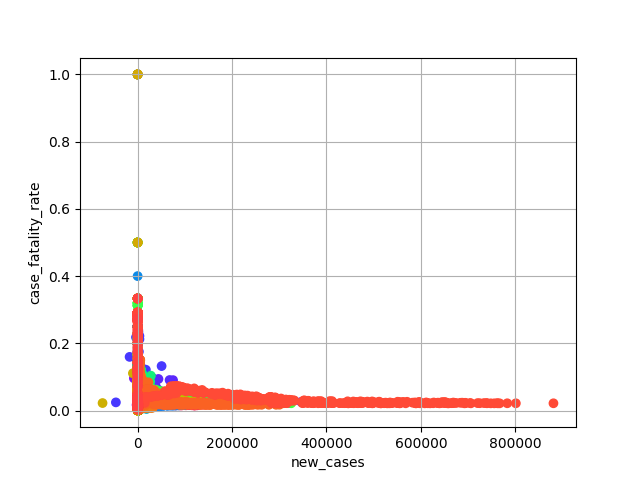
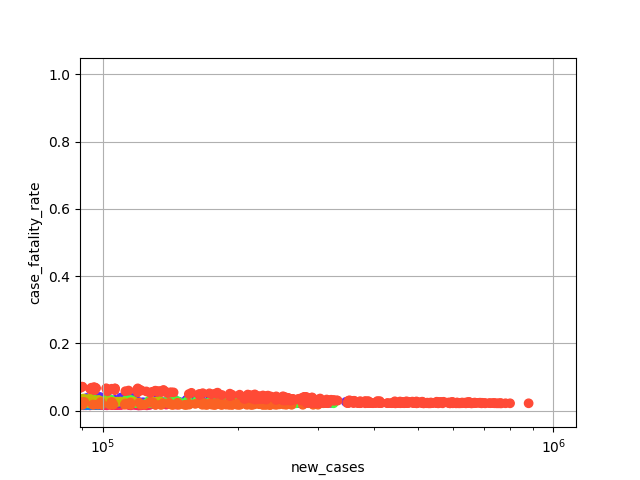

# COMP20008 2021 Semester 1 Assignment 1

1186495 Yujean Song

## About the Assigment 1

### Part A
Use a provided 'covid-owid-data' and use data occured at 2020 to be analysed by month and add new column that matches month and location.
Also, added new column 'case fatality rate' on dataframe called 'covid'. 
Finally, make the new csv file called 'covid-owid-data-2020-monthly' with new data.

By using 'covid-owid-data-2020-monthly', made a 2 scatter plot of case fatality rate (on the y-axis) and confirmed new cases on the x-axis) by locations in the year 2020.
Scatter - a plot is for normal scale and scatter - b plot is for log scale.

### Part B
By given cricket txt sets, find the document ID that each blongs to txt file. Then create a new csv file called 'partb1' that contains document IDs per each txt file.
Open the text file and remove all non-alphabetic characters, convert the white spaces into one blank white space, and change all upper cases into lower cases.
Finally, made the 'Document ranking search method'. For this method, just compared the text if it's equal. Then, compared stemmed word between texts. From this process, for the comparison, the text is ranked by cosine similarity and vector.

### List of Dependence
* import re
* import sys
* import pandas as pd
* import os
* import nltk
* from sklearn.feature_extraction.text import TfidfTransformer
* from numpy import dot
* import numpy as np
* from numpy.linalg import norm
* from functools import reduce 
* import argparse
* import matplotlib.pyplot as plt
